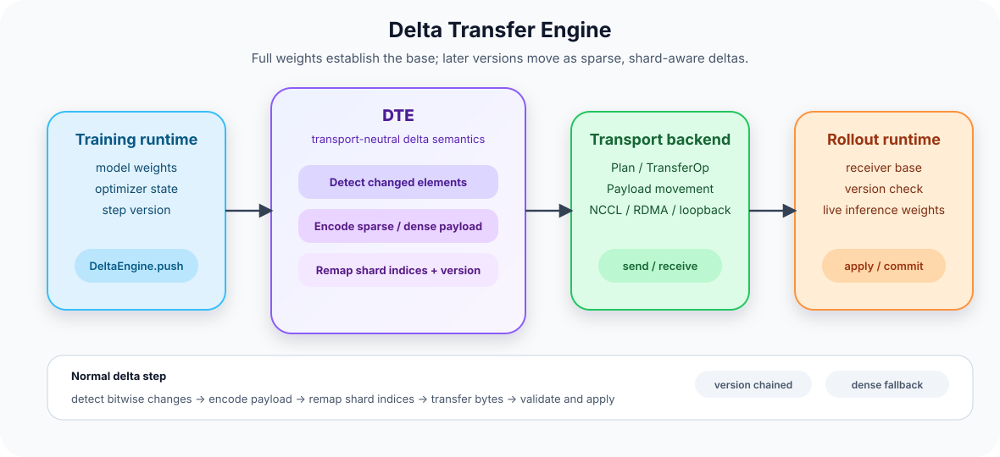

# AReaL-DTE

Delta Transfer Engine（`dte`）为分布式强化学习训练与推理提供增量权重同步。

[English](README.md) | [简体中文](README.zh-CN.md)

> 面向在线 RL 的版本化稀疏权重增量同步。训练侧和推理侧即使用不同 TP/PP/EP 分片布局， 也可以只同步本步真正变化的权重元素。

`dte` 是一个增量权重传输引擎。它用于在线 RL 训练中的 trainer -> rollout 权重同步： 首次同步发送完整权重建立 base，后续 step 只发送
sparse delta，让 rollout 侧更快拿到新 policy。

## 为什么需要 dte

全量权重同步语义简单，但每个 RL step 都搬整个模型，带宽和等待时间都会变成问题。以 bf16 为例， 一个 sparse delta 元素需要 6 bytes：4
bytes 的 int32 flat index，加上 2 bytes 的 bf16 value。 如果一个 tensor 只有 2% 元素变化，原始 sparse
payload 约为 dense 的 6%。payload 变小后， trainer 到 rollout 的权重交接通常更短，rollout 侧能更早开始使用新 policy。

`dte` 的重点不是只做一个 sparse 格式，而是把 sparse delta 放进分布式权重同步里：

- **权重交接更快。** 常规 step 发送 sparse delta，而不是完整 tensor。某个 tensor 不够稀疏时， `dte` 会对该 tensor 退回
  dense，避免 sparse path 反而变慢。
- **传输数据更少。** sparse step 的传输工作随 changed elements 增长，而不是随总参数量增长。 实际加速取决于后端、拓扑和 scatter
  开销。
- **bitwise 重建。** 变化检测比较浮点存储的整数视图，保留 NaN payload bit 和 signed zero。
- **支持 shard layout mismatch。** sparse index 会通过 `train_slices` / `inf_slices` 重映射，
  不要求训练侧和推理侧 shard 完全对齐。
- **版本安全。** 每个 delta 都带 `base_version` 和 `payload_version`；receiver 没有正确 base 就拒绝应用。
- **后端隔离。** 增量算法不依赖 NCCL、RDMA、awex、Mooncake 或具体 runtime。后端负责搬 bytes， `dte` 定义这些 bytes
  的语义。

传输模型很直接：

1. 首次发送完整权重，在 receiver 侧建立 base。
1. 后续 step 检测哪些权重元素发生变化。
1. 编码 changed flat indices 和 new values。
1. 如果训练/推理分片不同，重映射 sparse indices。
1. receiver 只有在 base version 匹配时才应用 patch。

## 架构

<p align="center">
  
</p>

图源文件：[docs/images/dte_architecture.svg](docs/images/dte_architecture.svg)

这张图只保留主边界：runtime 持有模型状态，DTE 定义 delta 语义，backend 负责传输。内部模块如下：

| 模块                                         | 作用                                                                                                                                                  |
| -------------------------------------------- | ----------------------------------------------------------------------------------------------------------------------------------------------------- |
| `DeltaEngine`                                | 对外编排层。sender 侧判断 full/delta、调用 tracker、发送 payload；receiver 侧校验 version chain，并把重建后的 tensor 写入目标参数。                   |
| `DeltaTracker`                               | sender-side delta 状态。full sync 后 seed base；从 snapshot 或外部 mask 计算 bitwise mask；输出 sparse/dense/unchanged entries。                      |
| Delta codec                                  | flat named-tensor 协议：`__awex_delta_header__`、`w@delta_idx`、`w@delta_val` 和 dense fallback `w`。该格式可以复用已有 tensor grouping 和 IPC 路径。 |
| `reconstruct_against_base`                   | receiver-side 重建。把 sparse patch 打到本地 base 上，采用 dense fallback，并刷新下一版本 base。                                                      |
| `remap_delta_indices`                        | 把训练 shard 上的 sparse flat indices 转成推理 shard indices，使用 `train_slices` 和 `inf_slices`。                                                   |
| `delta_p2p` / `colocate_protocol`            | 变长 sparse P2P 的两轮协议：先交换 `nnz`，再交换 `idx` 和 `val`。zero-nnz op 也参与，保证 rank 调度对称。                                             |
| `Transport`, `Plan`, `TransferOp`, `Payload` | 后端契约。`Plan` 描述 rank 对和 shard slices；`Payload` 是要搬的数据；`Transport` 定义 `build_plan`、`send` 和 `recv`。                               |
| Backends                                     | `loopback` 用于 CPU 本地测试；`awex_backend` 复用 awex reshard plan 和 NCCL 调度；`mooncake_backend` 面向 RDMA 路径。                                 |

常规 delta step 的数据路径：

```text
detect -> encode -> transport.send/recv -> decode -> reconstruct -> apply
```

这样拆分后，bitwise diff、sparse encoding、version check 和 index remap 都能在无集群环境下测试。
NCCL、RDMA、MetaServer 和 runtime 集成留给 backend。

## 算法概览

`dte` 把权重同步看成一个带版本的状态转移：

```text
theta_v --Delta(v -> v+1)--> theta_{v+1}
```

receiver 保存 version `v` 的完整 base `{name: tensor}`。delta payload 只有在 `base_version == v`
时才有效；不匹配就拒绝应用，并要求调用方重新 full sync。这个检查很关键： sparse patch 不是完整模型状态，不能随便打到任意权重上。

### 1. 检测变化元素

对每个参数 `w`，sender 构造变化集合：

```text
C_w = { i | bits(theta_t[w][i]) != bits(theta_base[w][i]) }
```

这里比较的是 bit pattern，不是浮点 `!=`。NaN payload bits、signed zero、bf16 rounding artifact 和 fp32
router weights 都按相同位宽的整数视图比较。

delta mode 支持多种变化检测输入：

- **Snapshot diff：** 保存上一版已传输权重的 CPU copy，当前权重和 snapshot 做 bitwise diff。直接使用
  `DeltaTracker.encode(..., masks=None)` 时，这是 standalone fallback。
- **AdamW inversion mask：** 从 AdamW moments 反推 optimizer step 前的权重，再和当前权重比较。AReaL 的 DTE
  示例启动脚本默认使用该 delta 配置，避免额外保存一份完整 snapshot。

decoupled AdamW 的反推式：

```text
u_t = (lr / (1 - beta1^step)) * m_t / (sqrt(v_t / (1 - beta2^step)) + eps)
theta_{t-1} = (theta_t + u_t) / (1 - lr * weight_decay)
```

inversion path 可以避免 `DeltaTracker` 内部保存完整 snapshot；调用方把 `{name: bool_mask}` 传给
`encode(...)` 即可。

- **外部 mask 和 indices：** 调用方也可以传 bool mask、已排序的整数变化 indices，或从 optimizer packed dirty
  bits 解码出的 indices。

`DeltaEngine.mode` 只有 `"delta"` 和 `"full"`。snapshot、AdamW inversion 和 dirty-bit 是 delta
mode 内部的检测策略，不是新的 engine mode。AReaL 集成建议正常运行默认使用 AdamW inversion，同时保留 snapshot 作为
fallback 和校验方案，包括 MoE 模型验证。

### 2. 按 tensor 选择 sparse 或 dense

设 tensor 有 `n` 个元素，元素大小为 `s` bytes，变化元素数 `k = |C_w|`：

```text
dense_bytes(w)  = n * s
sparse_bytes(w) = k * (4 + s)       # int32 flat index + value
```

`DeltaTracker` 只有在以下条件满足时才发 sparse：

```text
k > 0
n < 2^31
sparse_bytes(w) <= sparse_bytes_ratio * dense_bytes(w)
```

否则该 tensor 本 step 走 dense fallback。一个 delta payload 可以同时包含 sparse tensor、 dense fallback
tensor 和 omitted unchanged tensor：

```text
__awex_delta_header__ -> [magic, codec, payload_version, base_version, counts]
w@delta_idx           -> int32[k]
w@delta_val           -> dtype[k]
w                     -> dense fallback tensor
```

unchanged tensor 不发送。dense fallback tensor 会像 full sync 一样刷新 receiver base 中对应参数。

### 3. 跨 shard layout 重映射 sparse indices

sparse index 在训练 shard 的 flat index space 中计算。如果 rollout 侧使用不同 TP/PP/EP 布局， 这些 index
必须通过 transfer plan 投影到目标 shard。

对每个 `TransferOp`：

```text
train_slices = op.train_slices
inf_slices   = op.inf_slices
```

重映射过程：

```text
p  = training-shard flat index
c  = unravel(p, train_shape)
keep c only if c is inside train_slices
c' = c - train_start + inf_start
p' = ravel(c', infer_shape)
```

values 用同一个 mask 过滤。receiver 最终把 `values[j]` scatter 到自己 inference shard 的
`p'[j]`。这个函数只做几何变换；NCCL、RDMA 和 IPC 仍然是后端的职责。

### 4. receiver 侧重建

transport 收到 payload 后，receiver 解码并基于本地 base 重建完整 tensor：

```text
if tensor is dense:
    full = payload[name]
elif tensor is sparse:
    full = clone(base[name])
    full[delta_idx] = delta_val
else:
    full = clone(base[name])
```

重建后的 tensor 写入 live inference parameters，CPU base 刷新到 `payload_version`。在 colocate NCCL
路径里，变长 sparse patch 使用两轮协议：先为每个 op 交换 `nnz`，再交换 `(idx, val)`。 zero-nnz op 也必须参与，这样每个
rank 才会走同一套调度序列。

## 仓库结构

- `src/dte/core/`：delta 算法，包含 bitwise diff、AdamW inversion helper、sparse codec、
  reconstruction、shard index remap 和 colocate P2P 协议逻辑。
- `src/dte/engine.py`：`DeltaEngine` sender/receiver 控制流。
- `src/dte/transport.py`：后端无关的 `Transport`、`Plan`、`TransferOp` 和 `Payload` 类型。
- `src/dte/backends/loopback.py`：CPU in-memory backend，用于测试。
- `src/dte/backends/awex_backend.py`：awex adapter，复用 awex transfer plan 和 NCCL 调度。
- `src/dte/backends/mooncake_backend.py`：Mooncake/RDMA 方向的 packing path 和接口。
- `src/dte/backends/http_backend.py`：通过共享文件系统或 S3-compatible object store 暂存权重，提供原子
  manifest、checksum 和有界内存流式传输。
- `docs/design.md`：完整设计、公式、协议不变量和验证边界。
- `docs/awex-gpu-verification.md`：`AwexTransport` GPU parity 检查清单。

## 安装

要求：

- Python >= 3.11 且 \< 3.13
- 主要 Linux 环境使用 PyTorch >= 2.9.1 且 \< 2.11

从源码安装：

```bash
python -m pip install -e .
```

开发环境：

```bash
python -m pip install -e ".[dev]"
```

可选传输后端：

```bash
python -m pip install -e ".[awex]"      # dingzhiqiang/asystem-awex + NCCL runtime
python -m pip install -e ".[mooncake]"  # Mooncake Transfer Engine
python -m pip install -e ".[http]"      # 共享文件系统暂存传输
python -m pip install -e ".[http,s3]"   # 额外安装 S3-compatible store provider
python -m pip install -e ".[http,oss]"  # 原生 Alibaba Cloud OSS provider
```

默认安装已经可以使用 core algorithm 和 loopback backend。集群后端还需要对应 runtime、硬件和 分布式环境。发布 PyPI 之后，可以使用
`delta-transfer-engine[...]` 安装同样的 extras。

## 快速开始

```python
from dte import DeltaEngine
from dte.backends import LoopbackTransport

engine = DeltaEngine(
    transport=LoopbackTransport(),
    mode="delta",
    anchor_interval=10,
)

# Trainer side.
engine.push(model.named_parameters(), version=step)

# Rollout side.
engine.pull(target_params, version=step)
```

`mode="delta"` 首次 full sync 建 base，普通 step 使用 sparse delta，并支持周期性 full anchor。
`mode="full"` 不做检测，每步都发送 dense weights。standalone engine 在没有外部 mask 时使用 snapshot
diff；AReaL 示例默认提供 AdamW inversion mask。

当 sender 和 receiver 之间没有实时通信链路时，HTTP backend 可以把每个版本作为 immutable blob 暂存到共享文件系统或
S3-compatible object store：

```python
from dte import DeltaEngine
from dte.backends import HttpTransport, SharedFSStore

store = SharedFSStore("/mnt/weights")

# Trainer process。full payload 没有 header，因此由 begin() 提供版本号。
sender = DeltaEngine(HttpTransport(store, stream="run-1"))
sender.transport.begin(step)
sender.push(model.named_parameters(), version=step)

# 任意能读取相同 store 的 rollout process。
receiver = DeltaEngine(HttpTransport(store, stream="run-1"))
receiver.pull(target_params, version=step)
```

Payload 使用 zstd-compressed safetensors，并同时校验文件和 tensor checksum。完整版本由 manifest
原子提交；chunked publish/fetch 和 `DeltaEngine.reconstruct_stream` 为大模型限制暂存峰值内存。

Sender 和 receiver 实例需要跨 step 保留。示例使用单 writer，由调用方等待发布并按版本顺序消费； `recv()` 只读取一次
latest，不自动补齐跳过的 delta。多 writer 使用 `publish` / `write_manifest` / `iter_fetch`，shard
路由由应用负责；单个 `reconstruct_stream` 要求跨 writer 的参数名唯一。通过 writer marker 提前读取时，仍需等待最终 manifest
才能对推理暴露新版本。新 anchor 会删除更早版本，遇到并发清理的 reader 需要重新加载当前 anchor。

原生 OSS 路径由应用创建带 V2 或 V4 认证的 `oss2.Bucket`，然后注入 provider：

```python
from dte.backends import HttpTransport, OSSStore

store = OSSStore(bucket_client=oss_bucket, prefix="dte/run-1")
transport = HttpTransport(store, stream="policy", prune_on_anchor=False)
```

`prune_on_anchor=False` 保留旧版本，由应用单独管理清理；默认值仍为 `True`，保持已有行为。 OSS
路径使用内存缓冲，不需要本地暂存文件。默认对至少 64 MiB 的 blob 使用顺序 multipart 上传，可配置阈值和 part 大小；打包后的完整 blob
仍占用内存。中断上传不会提交对象，未完成的 multipart 需要单独清理。凭据、endpoint、region 和 SDK 连接设置由应用管理。

## 开发

```bash
python -m pip install -e ".[dev]"
ruff check .
ruff format --check .
mdformat --check README.md README.zh-CN.md CONTRIBUTING.md docs
python -m pytest tests -q
python -m build
```

CPU 测试覆盖 core algorithm、`DeltaEngine`、loopback transport 和不需要真实集群的 backend contract。awex
的 GPU parity 在 `docs/awex-gpu-verification.md` 单独跟踪。

## 当前状态

| Area                 | State                                                                                                                                                                               |
| -------------------- | ----------------------------------------------------------------------------------------------------------------------------------------------------------------------------------- |
| Core delta algorithm | CPU tests cover snapshot diff、外部 mask 和有序 indices、packed dirty bits、sparse/dense fallback、tied-storage snapshot dedup、remap fast path、AdamW inversion 和 version chain。 |
| `DeltaEngine`        | CPU end-to-end tests cover full/delta sync、anchor、no-op delta、broken chain，以及事务式 `decode_for_live_apply` / `commit_live_apply`。                                           |
| `loopback` backend   | Local test backend.                                                                                                                                                                 |
| `awex` backend       | Adapter 使用 `dingzhiqiang/asystem-awex`；colocate sparse path 支持合并后的两轮 metadata/data exchange。真实跨 rank parity 仍需要 NCCL + MetaServer + megatron/sglang。             |
| `mooncake` backend   | Interface and pack/unpack path are present. RDMA execution needs a Mooncake runtime.                                                                                                |
| `http` backend       | CPU tests cover shared filesystem、multi-writer manifest、chunk streaming、retention、corruption handling 和 S3 contract。                                                          |

## License

本项目使用 [Apache License 2.0](LICENSE)。
