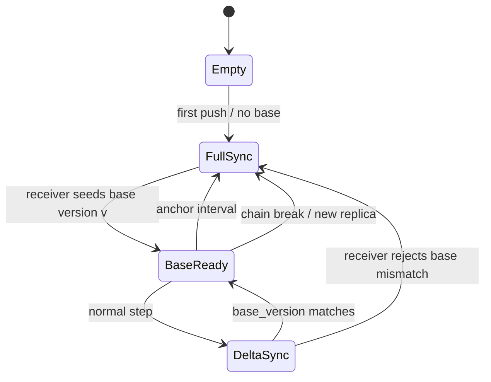
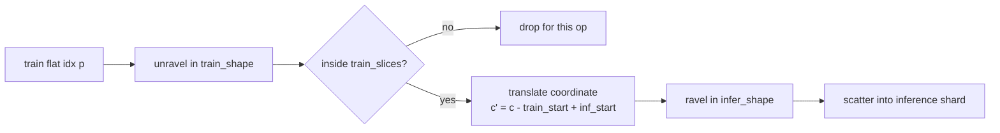
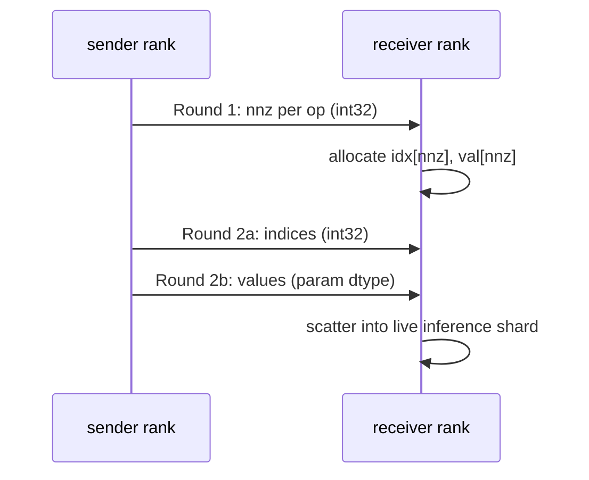

# Delta Transfer Engine 设计说明

`dte` 解决在线 RL 训练里的权重同步问题。训练侧每个 GRPO/PPO step 都会更新 policy， 推理侧 rollout engine
需要尽快拿到新权重。全量同步语义最简单，但每步都搬整个模型。 `dte` 的做法是先建一个完整 base，后续只传相对 base 的变化。

难点不在“稀疏”本身，而在分布式场景里的约束：

- 权重变化检测必须 bitwise lossless，不能用浮点相等语义。
- delta 只能应用在它声明的 base version 上。
- 训练 shard 和推理 shard 可能不同，flat index 必须重映射。
- 变长稀疏 payload 进入 P2P 后，rank 间协议必须对称。
- 推理 runtime 如果 release 权重，必须能恢复完整 base。

当前仓库把与传输无关的算法抽到 `src/dte/core`。awex、Mooncake 等后端只负责 plan 和 byte movement。awex/AReaL
原型已经在 BailingMoeV2.5 Flash MoE、bf16 主体加 fp32 router、4 机 32 卡环境跑过 50 步和 frozen 正确性验证。当前
`AwexTransport` 的 upstream awex parity 仍按 `docs/awex-gpu-verification.md` 做集群验证。

## 1. 系统架构

<p align="center">
  
</p>

图源文件：[docs/images/dte_architecture.svg](images/dte_architecture.svg)

这张图表达的是边界，不是线程模型。训练/推理 runtime 仍由上层系统管理；`dte` 不创建模型，也不 接管分布式初始化。`dte` 的责任是定义 full/delta
语义，把 payload 交给后端，并在接收端按版本 链重建权重。

### 1.1 模块职责

| 模块                       | 输入                                                                 | 输出                                               | 责任                                                                                                             |
| -------------------------- | -------------------------------------------------------------------- | -------------------------------------------------- | ---------------------------------------------------------------------------------------------------------------- |
| `DeltaEngine.push`         | 当前参数、version、可选 `Plan`                                       | `Payload` list，经 `Transport.send` 发出           | sender 入口。判断本步 full 还是 delta；full 时 seed tracker；delta 时调用 tracker 编码。                         |
| `DeltaEngine.pull`         | `Transport.recv` 得到的 payload、目标参数 dict、version              | 写入后的目标参数；内部刷新 receiver base           | receiver 入口。识别 full/delta，校验 delta base，调用重建逻辑并写回目标权重。                                    |
| `DeltaTracker`             | 当前参数、base version、snapshot 或外部 mask                         | flat named-tensor delta payload                    | sender-side 状态机。维护 base version、anchor 计数、CPU snapshot；按 cost model 选择 sparse 或 dense fallback。  |
| `Detector helpers`         | 当前权重、snapshot 或 AdamW moments                                  | bool change mask                                   | 生成变化集合。snapshot 路径做 bitwise diff；AdamW inversion 路径先反推上一步权重，再生成 mask。                  |
| `Delta codec`              | 每个参数的 changed indices / values                                  | header、`@delta_idx`、`@delta_val`、dense fallback | 定义 wire format。header 携带 `payload_version`、`base_version` 和 sparse/dense 计数。                           |
| `reconstruct_against_base` | receiver CPU base、decoded delta                                     | 完整 `{name: tensor}`，并刷新 base                 | 接收端重建。sparse 参数先拷贝 base 再 scatter；dense fallback 直接采用；省略参数从 base 恢复。                   |
| `remap_delta_indices`      | sparse patch、train shape、`train_slices`、`inf_slices`、infer shape | inference-shard flat indices                       | 处理 shard mismatch。它只做几何变换，不发数据。                                                                  |
| `delta_p2p`                | per-op mask、send params、recv params、transfer ops                  | `nnz` vector、idx/val buffers、scatter apply       | 处理变长 sparse payload 的两轮协议。保证 zero-nnz op 也参与，避免 rank 序列不对称。                              |
| `Transport`                | `Plan`、`Payload`                                                    | backend-specific bytes movement                    | 后端接口。`build_plan` 产生或包装几何，`send/recv` 搬 payload；`colocate_apply` 支持 awex 的对称 colocate 路径。 |
| backends                   | runtime-specific metadata 和通信资源                                 | 具体传输行为                                       | `loopback` 用于 CPU 测试；`awex` 复用 awex plan/NCCL；`mooncake` 面向 RDMA put/get。                             |

### 1.2 控制面和数据面

`Plan` 属于控制面。它描述 rank 对、参数名、源 shard slice 和目标 shard slice。`Payload` 属于 数据面。它描述本次要发的
tensor：full tensor、flat delta tensor，或后端未来可能使用的结构化 sparse payload。

普通 `send/recv` 后端可以把 `Payload` 当成 named tensors 搬运。awex colocate 路径比较特殊： 它的传输是对称
exchange，本地 self-copy 和 cross-rank P2P 在同一个调用里完成，所以 `AwexTransport` 通过 `colocate_apply`
接入 `core.colocate_protocol`。

| 层            | 负责                                                       | 不负责                      |
| ------------- | ---------------------------------------------------------- | --------------------------- |
| `DeltaEngine` | full/delta 生命周期、调用 core、调用 transport             | 具体通信算法                |
| `dte.core`    | diff、codec、version chain、patch、remap、P2P payload 协议 | NCCL/RDMA/MetaServer 初始化 |
| `Transport`   | 构造或承接 transfer plan，搬运 payload                     | 判断哪些元素变化            |
| runtime 后端  | awex/Mooncake/loopback 的资源管理                          | 修改 delta 语义             |

这个边界让 CPU 单测能覆盖算法主体。真正依赖集群的部分只剩 backend integration。

### 1.3 Staged blob backend

`HttpTransport` 不要求 sender 和 receiver 之间存在实时连接。每个 writer 把当前 anchor 或 delta 写成
zstd-compressed safetensors chunk，通过 `BlobStore` 暂存到共享文件系统或 S3-compatible object
store。文件和 tensor checksum 都按 writer 作用域记录，因此不同 writer 可以安全地发布同名参数 shard。

Writer 先原子写 payload，再发布自己的完成 marker；rank 0 收齐所有 writer metadata 后最后 写 version manifest 和
`latest.json`。Reader 只有在 manifest 完整时才把版本视为已提交，也可以 通过 writer marker 提前流式应用已经完成的 shard。新的
full anchor 默认会删除更早的 anchor 和 delta；`prune_on_anchor=False` 可关闭自动删除， 让应用为慢 reader
保留版本并单独运行清理。

`DeltaEngine.reconstruct_stream` 逐 chunk 重建 receiver base。每个 sparse 参数的
`@delta_idx`/`@delta_val` 必须位于同一 chunk；中途失败会使 version chain 保持未提交状态，下一次 delta
因此不能错误地应用到部分更新的 base 上。

Store 需要是受信任的目录或 bucket，调用方负责写入权限、版本单调发布和 shard 路由。 Manifest 的 `writers` 数组按 writer rank
保存 files、tensor checksums 和可选 full-state checksums；此结构不兼容将 checksums 按全局参数名扁平合并的早期原型。 同名
shard 可以分别校验与拉取，但一个 `reconstruct_stream` 的 base 以参数名索引，因此输入必须 先由调用方路由成不重名的完整参数。Early
apply 期间应暂停推理，并在所有 writer 完成且 manifest 可见后发布新模型版本；流式重建本身不会轮询 manifest。

原生 OSS 使用 `OSSStore` 实现相同 `BlobStore` 契约。应用注入已经初始化的 `oss2.Bucket`， 明确选择 endpoint
和签名模式；provider 不探测或自动降级签名。所有 key 限制在独立 run prefix。 普通对象使用 PUT/GET，大对象通过 multipart 的
complete 操作提交；失败的 multipart 保留为未完成 上传，由应用清理。Reader 完成读取后关闭响应以释放连接。仅 `NoSuchKey`
被映射为对象不存在， 鉴权失败、bucket 不存在和网络错误继续向调用方传播。

## 2. 生命周期



`mode="full"` 每步都走 `FullSync`，不触发 detector。`mode="delta"` 首步 full seed，普通 step 发
delta，达到 anchor interval 后重新 full sync。full sync 没有 header，receiver 采用调用方 传入的 version 作为
base version；delta sync 必须带 header，receiver 自己校验链路。

## 3. Delta payload 协议

full payload 仍是普通 `{name: tensor}`。delta payload 使用 flat named-tensor 格式，目的是复用 已有的
tensor grouping、IPC 序列化和 transport 管线。

```text
__awex_delta_header__ -> int64[6]
w@delta_idx           -> int32[nnz]
w@delta_val           -> dtype[nnz]
w                     -> dense fallback tensor
```

header:

```text
[magic, codec_version, payload_version, base_version, num_sparse, num_dense]
```

对每个参数 `w`，编码结果只有三种：

| 情况                 | payload                      | receiver 行为                                       |
| -------------------- | ---------------------------- | --------------------------------------------------- |
| 稀疏划算             | `w@delta_idx`, `w@delta_val` | 从 base 拷贝 full tensor，再 scatter changed values |
| 稠密更划算或参数未知 | `w`                          | 直接采用 dense tensor，并刷新 base                  |
| 没变化               | 省略                         | 从 base 恢复 unchanged tensor                       |

如果 delta 里出现 base 不存在的 sparse 参数，receiver 直接报错。不能根据 `indices.max()` 猜
shape；这会把链路错误伪装成一个形状不可靠的 tensor。

## 4. 变化检测

### 4.1 bitwise diff

浮点比较会漏掉或误报权重变化：

- `NaN != NaN`，即使两个 NaN 的 bit pattern 一样。
- `-0.0 == +0.0`，即使符号位不同。

因此检测函数先把浮点 tensor reinterpret 成同宽整数 tensor，再做逐元素比较：

```text
mask = int_view(theta_t) != int_view(theta_base)
```

bf16 权重会按 int16 比较，fp32 按 int32 比较。这样得到的是 bit pattern 的变化集合：

```text
C_w = { i | bits(theta_t[w][i]) != bits(theta_base[w][i]) }
```

### 4.2 AdamW inversion mask

snapshot diff 需要保存一份上一版权重。对大模型来说，这是一份可观的 CPU 内存。AdamW 路径可以 从当前权重和 optimizer moments
反推更新前权重，再生成 mask。

对 decoupled AdamW：

```text
bc1 = 1 - beta1^step
bc2 = 1 - beta2^step
u_t = (lr / bc1) * m_t / (sqrt(v_t / bc2) + eps)
theta_t = theta_{t-1} * (1 - lr * wd) - u_t
theta_{t-1} = (theta_t + u_t) / (1 - lr * wd)
```

实现用 fp32 计算 `theta_{t-1}`。外部 detector 可以把 inversion 得到的上一版权重和当前权重转成 同一目标 dtype 后做
bitwise diff，然后把 `{name: mask}` 交给 `DeltaTracker.encode(masks=...)`。 这一路径不需要 tracker 存
full snapshot；tracker 只记录已知参数名和 version chain。

数值边界需要明确处理：`1 - lr * wd` 不能接近 0，moments 的 step 必须和当前权重对应，mask 的 shape 必须和参数一致。mask 缺失或
shape 不匹配时，该参数走 dense fallback。

## 5. 稀疏编码的 cost model

设参数 `w` 有 `n` 个元素，元素大小为 `s` bytes，变化元素数为 `k = |C_w|`。

```text
dense_bytes(w)  = n * s
sparse_bytes(w) = k * (4 + s)
```

4 bytes 来自 int32 flat index。`DeltaTracker` 的规则是：

```text
use_sparse(w) =
  n < 2^31
  and k > 0
  and sparse_bytes(w) <= sparse_bytes_ratio * dense_bytes(w)
```

默认 `sparse_bytes_ratio = 0.9`。它不是理论 break-even，而是保守阈值。以 bf16 为例， `s = 2`，纯字节 break-even
是：

```text
k * (4 + 2) < n * 2  =>  k / n < 1/3
```

实际通信还有 buffer、scatter、调度开销，所以实现允许用户用 ratio 调整 fallback 边界。

复杂度：

| 阶段               | 时间                                   | 额外内存                    |
| ------------------ | -------------------------------------- | --------------------------- |
| bitwise diff       | `O(n)`                                 | mask `O(n)`，indices `O(k)` |
| sparse encode      | `O(k)` gather                          | idx/value payload `O(k)`    |
| dense fallback     | `O(n)` copy/transfer                   | dense payload `O(n)`        |
| reconstruct sparse | `O(n + k)`，因为先拷贝 base 再 scatter | full tensor copy            |

## 6. Version chain 与 receiver base

delta 不是完整状态，它只定义从 `base_version` 到 `payload_version` 的变换：

```text
Delta(v -> v+1) = {header(base=v, payload=v+1), sparse patches, dense fallbacks}
```

receiver 保存：

```text
base: Dict[name, CPU tensor]
base_version: int
```

应用规则：

```text
if payload is full:
    base = clone(payload)
    base_version = caller_version

if payload is delta:
    require header.base_version == base_version
    full = reconstruct_against_base(base, payload)
    base = clone(full)
    base_version = header.payload_version
```

这是正确性前提：receiver 必须持有完整上一版 base。原型里 sglang colocate 每步 release 推理活 权重，默认 resume 只恢复
buffers，不恢复 parameters。dense sync 会重填所有参数，因此问题 被掩盖；delta sync 只传 changed 元素，unchanged
参数只能来自 base。最后采用 `enable_weights_cpu_backup`，release 时 D2H 备份完整 weights，resume 时 H2D
恢复，再打 patch。

## 7. Shard-aware index remap

训练 shard 上的 sparse index 不能直接写到推理 shard。`TransferOp` 描述一个训练 shard 区域和 推理 shard 区域的重叠：

```text
train_slices = (slice(a_0, b_0), ..., slice(a_d, b_d))
inf_slices   = (slice(a'_0, b'_0), ..., slice(a'_d, b'_d))
```

对源 shard flat index `p`：

```text
c = unravel(p, train_shape)
keep iff a_j <= c_j < b_j for every dimension j
c'_j = c_j - a_j + a'_j
p' = ravel(c', infer_shape)
```



并行维度上的含义：

| 维度 | 处理                                                        |
| ---- | ----------------------------------------------------------- |
| TP   | shard 粒度不同，必须按 `train_slices` / `inf_slices` 重映射 |
| PP   | layer 无重叠时没有 op；有 op 时按该 op 的 overlap 处理      |
| DP   | 权重副本相同，通常只让一个 DP head 发送                     |
| EP   | expert 没命中时 delta 为空；命中时和普通参数一样 remap      |

实现只支持连续 slice。strided slice 会直接报错，因为坐标平移公式不再成立。目标 shard 元素数 必须小于 `2^31`，否则 int32 flat
index 会溢出，该参数应走 dense fallback。

## 8. Colocate 两轮 P2P

稀疏 patch 是变长数据。receiver 不能只靠 static transfer plan 预分配 recv buffer，所以协议 分成 control plane
和 data plane。



协议不变量：

- 每个 rank 遍历相同 op 序列。
- `nnz == 0` 的 op 也必须进入 Round 1。
- Round 2 的 idx 和 val buffer 顺序必须和 Round 1 完全一致。
- 混合精度按 dtype 分组；所有 rank 按相同 dtype 顺序进入每个组。
- self-copy 段走本地 dense copy；cross-rank 段才走 sparse P2P。

awex 路径复用 `execute_recursive_partition_stream_transfer` 做实际 P2P 调度。`dte.core` 只构造
payload、nnz vector 和 scatter 逻辑，不创建 NCCL group。

## 9. 从原型抽取出的工程约束

### D1: P2P op 太多会挂住

4 机 32 卡 full transfer 时，一个 peer 内两万多个 P2P op 一次进入 `batch_isend_irecv`，rollout 端 recv
长时间不动。处理方式是按 `AWEX_CHUNK_MB` 分块，并用 `all_reduce` 对齐全局 chunk 数。

### D2: 权重写入必须 no_grad

SGLang 活权重 view 在 no_grad 下创建，AReaL driver 主循环默认 grad-enabled。对这些 view 做 inplace `copy_`
会触发 autograd 错误。权重更新整体包 `torch.no_grad()`。

### D3-D4: 混合 dtype 不能塞进单 dtype 协议

Flash MoE 是 bf16 主体加 fp32 router。Round 1 只交换 nnz，不携带 per-op dtype；receiver 若按 单一 dtype
预分配 val buffer 会失败。最终方案是按 dtype 分组，每组内部仍保持原两轮协议。

### D5: release/resume 不能丢 base

delta 只传 changed 元素。runtime 如果 release 后不能恢复完整 parameters，unchanged 部分就没有 正确来源。这个问题推动了第
6 节的 receiver base 不变量。

## 10. 验证状态

本地 CPU 测试覆盖：

- bitwise diff、sparse codec、decode validation、reconstruct against base；
- AdamW inversion helper；
- shard index remap 和 remap guard；
- colocate P2P payload 构造、zero-nnz 对称性、dtype 分组；
- `DeltaEngine` 的 full/delta/anchor/no-op/chain-break 路径；
- loopback、awex 适配器契约、Mooncake pack/unpack。
- HTTP staged transport 的 shared-filesystem、multi-writer manifest、checksum、chunk
  streaming 和中断后的 version-chain 行为。

集群侧：

- awex/AReaL 原型已经跑过 D1-D5、混合精度 MoE 长跑和 frozen 正确性验证。
- 当前 `AwexTransport` 还需要按 `docs/awex-gpu-verification.md` 做 upstream awex + dte 的
  bitwise parity。这个验证需要 NCCL process group、MetaServer、megatron/sglang reader 状态，CPU 单测
  不能替代。

## 11. 设计取舍

`dte` 不试图取代通信后端。后端已经掌握 rank、device、process group、RDMA endpoint 和 runtime
状态，继续由后端管理这些资源更符合现有系统边界。`dte` 只定义 delta 语义，并把这部分写成可测试的纯算法。

代价是接口上必须暴露足够的 geometry：`TransferOp` 不能只是 `(src, dst)`，还要携带 `train_slices` 和
`inf_slices`。这是稀疏 delta 能跨 TP/PP/EP layout 工作的前提。
